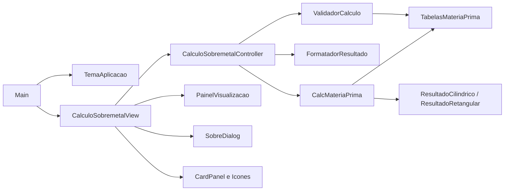
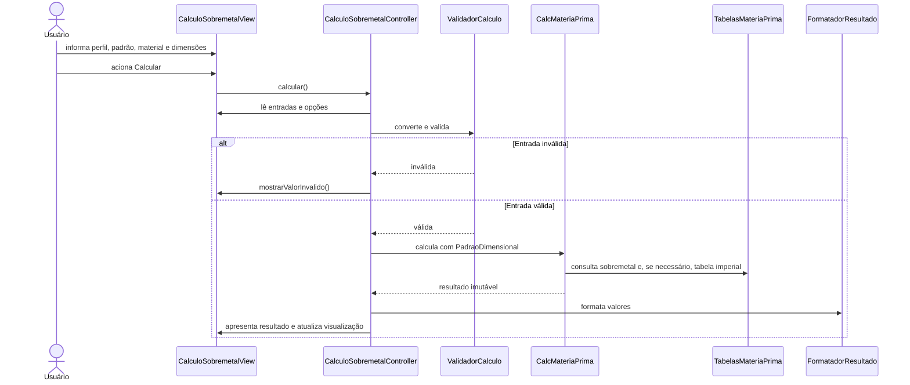
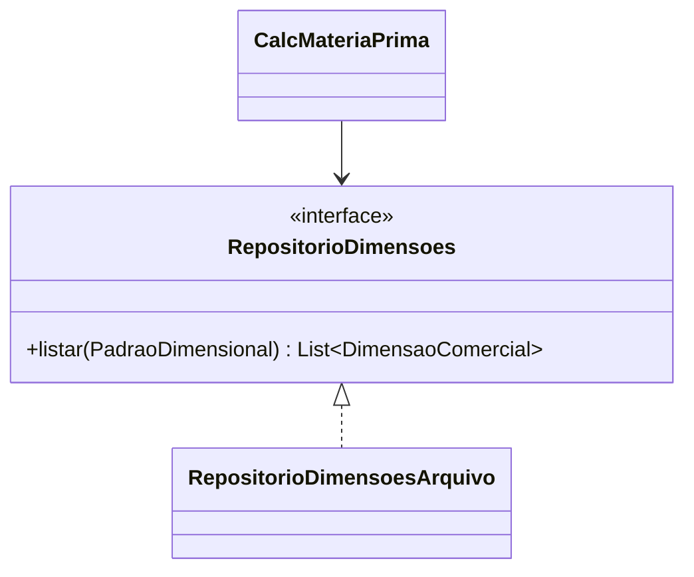

# Arquitetura

## Visão geral

O MateriaPrima é uma aplicação desktop Java 8 organizada em camadas simples. A
interface usa Swing com FlatLaf, enquanto cálculos, validações e dados técnicos
permanecem independentes da apresentação.

## Responsabilidades

| Área | Responsabilidade |
|---|---|
| `aplicacao` | Instalar o FlatLaf, iniciar o Swing e centralizar a versão exibida. |
| `view` | Montar os três cards, ler entradas, exibir resultados, copiar valores, mostrar ajudas e renderizar a visualização dinâmica. `SobreDialog` apresenta a referência técnica em abas. |
| `controller` | Coordenar o perfil escolhido, validar entradas e formatar a apresentação dos resultados. |
| `modelo` | Aplicar sobremetal, selecionar dimensões comerciais e calcular massa. |
| `dados` | Manter materiais, faixas de sobremetal e a tabela imperial em memória. |

## Padrões dimensionais

Todas as entradas e todos os cálculos internos usam milímetros.

- `PadraoDimensional.METRICO`: seleciona o próximo milímetro inteiro com
  `Math.ceil()`.
- `PadraoDimensional.POLEGADA`: seleciona uma `DimensaoComercial` da tabela
  imperial mantida por `TabelasMateriaPrima`.
- No retangular, largura, altura e comprimento são selecionados separadamente.
- A opção de permitir dimensão abaixo da recomendada preserva quatro regras históricas:
  - cilíndrico/milimétrico: 50% do sobremetal quando marcada e `Math.ceil()`;
  - cilíndrico/imperial: sobremetal integral e seleção inferior quando marcada;
  - retangular/milimétrico: 50% quando marcada, 1 mm fixo e `Math.ceil()`;
  - retangular/imperial: 50% quando marcada, 1 mm fixo e seleção inferior.

`DimensaoComercial` é imutável e associa:

- valor real em milímetros;
- descrição apresentada ao usuário;
- padrão dimensional.

## Fluxo de cálculo

## Interface

`CalculoSobremetalView` mantém três cards principais:

1. Dados de entrada;
2. Resultado;
3. Visualização dinâmica.

Os valores principais são `JTextField` não editáveis e selecionáveis. O
equivalente em milímetros permanece em `JLabel` separado, portanto a cópia de um
valor imperial contém somente a descrição em polegadas. Cada linha possui um
`JButton` de cópia acessível por teclado.

`PainelVisualizacao` usa `Graphics2D`, antialiasing e dimensões normalizadas. O
desenho preserva relações proporcionais, aplicando uma diferença visual mínima
para que sobremetais pequenos permaneçam perceptíveis.

`SobreDialog` é um `JDialog` modal próprio, aberto pela View principal. Suas abas
Sobre, Materiais, Tabelas e Cálculo documentam histórico, unidades, fórmulas e as
quatro combinações dimensionais. Materiais, faixas de sobremetal e dimensões
imperiais são carregados dinamicamente de `TabelasMateriaPrima`; a View apenas
formata esses objetos para apresentação, sem duplicar os dados técnicos.

## Dados e validação

- Arrays técnicos são devolvidos por cópia para impedir alteração externa.
- A tabela imperial é ordenada e termina em 38 polegadas, equivalentes a
  965,2 mm.
- O limite de entrada cilíndrico imperial é derivado pelo `ValidadorCalculo` a
  partir da maior dimensão comercial e da faixa de sobremetal. Atualmente, o
  diâmetro acabado deve ser menor que 919,2 mm.
- A tabela de sobremetal permanece compartilhada pelos dois perfis.
- Densidades cadastradas são armazenadas em kg/mm³ e apresentadas em g/cm³.

## Recursos e distribuição

- Imagens da ajuda: `src/main/resources/images/`.
- Ícones SVG: `src/main/resources/icons/`, carregados com `FlatSVGIcon`.
- Um ícone ausente gera aviso e não impede a abertura da aplicação.
- O Maven Shade Plugin produz `target/MateriaPrima.jar` com as dependências de
  execução incorporadas.
- Licenças de terceiros estão registradas em `THIRD_PARTY_NOTICES.md`.

## Evolução possível

A tabela em memória pode ser substituída futuramente por um repositório, sem
alterar a regra de seleção:

