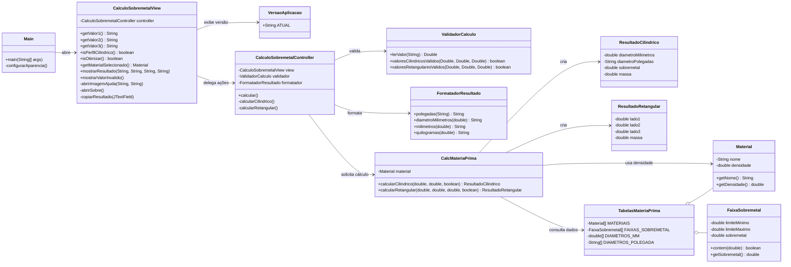
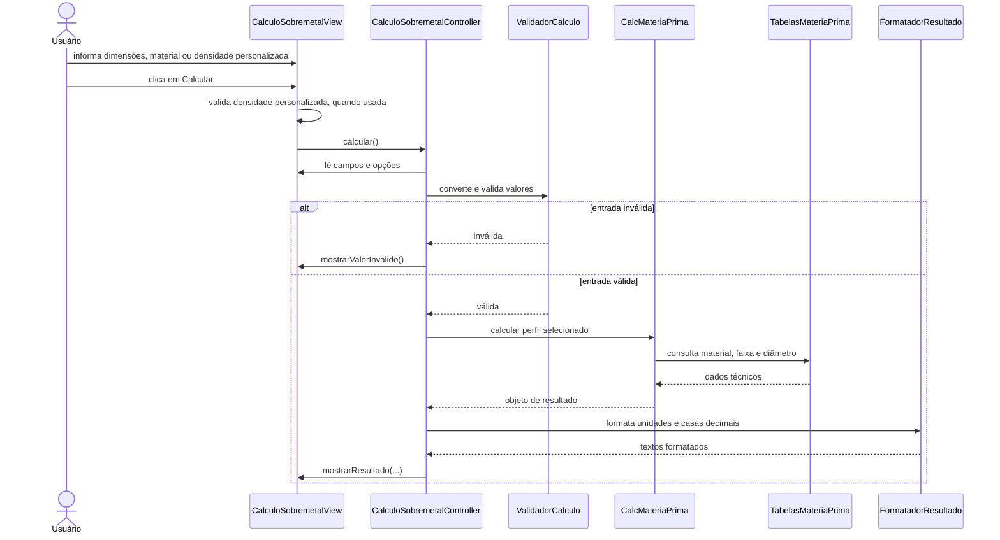
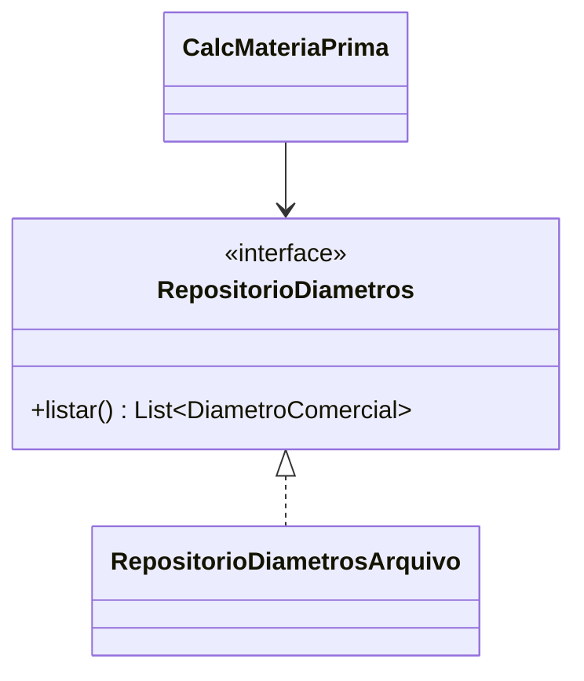

# Arquitetura

## Visão geral

A aplicação segue uma separação simples entre inicialização, interface, coordenação, domínio e dados técnicos.

## Fluxo de cálculo

## Responsabilidades

| Área | Responsabilidade |
|---|---|
| `aplicacao` | Iniciar o Swing, configurar aparência e declarar a versão apresentada. |
| `view` | Ler componentes visuais, validar a densidade personalizada e apresentar mensagens, resultados e ajudas contextuais. |
| `controller` | Coordenar a ação do usuário, validar e formatar. |
| `modelo` | Executar fórmulas e representar materiais, faixas e resultados. |
| `dados` | Manter e validar as tabelas técnicas em memória. |

## Decisões de projeto

- O modelo não guarda resultados temporários: cada operação retorna um objeto imutável.
- Materiais associam nome e densidade no mesmo objeto, evitando dependência de índices soltos.
- Faixas de sobremetal tornam explícita a relação entre limites e valor aplicado.
- As tabelas retornam cópias dos arrays para evitar alteração externa acidental.
- Diâmetros ainda permanecem em memória; a evolução prevista é introduzir um repositório baseado em arquivo.
- A View é construída diretamente com Swing, sem dependência de arquivos gerados por IDE.
- A densidade cadastrada é exibida em `g/cm³`; uma densidade personalizada é
  convertida pela View para `kg/mm³` antes da criação do `Material` temporário.
- A validação cilíndrica deriva o limite superior das faixas de sobremetal e da
  tabela de diâmetros comerciais, evitando um teto fixo desatualizado.
- As imagens de ajuda ficam em `src/main/resources/images` e são carregadas por
  `getResource`, permanecendo incorporadas ao JAR.
- Os resultados são campos não editáveis e selecionáveis; cada linha possui uma
  ação de cópia independente para a área de transferência.

## Evolução prevista

Quando os diâmetros forem persistidos, a dependência direta de `TabelasMateriaPrima` poderá ser substituída por uma abstração como:

