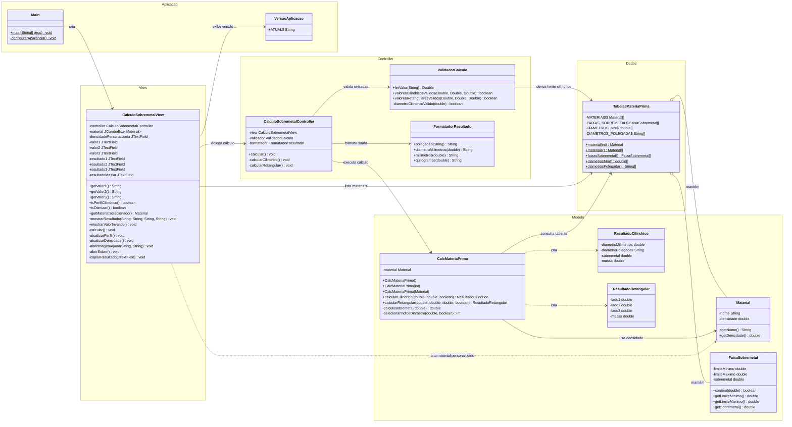
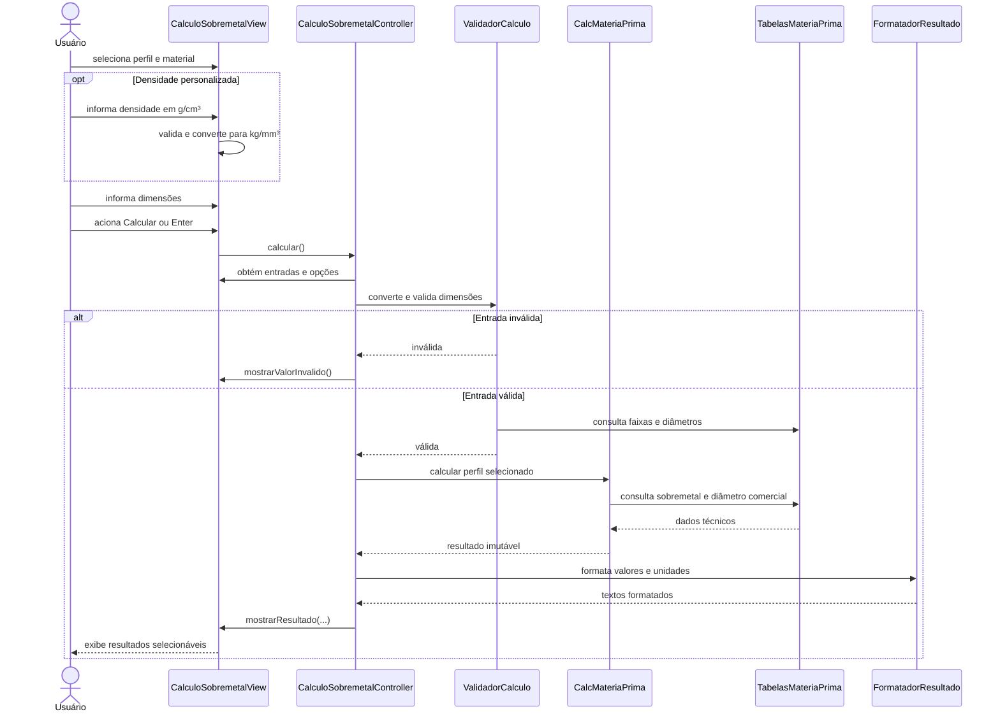
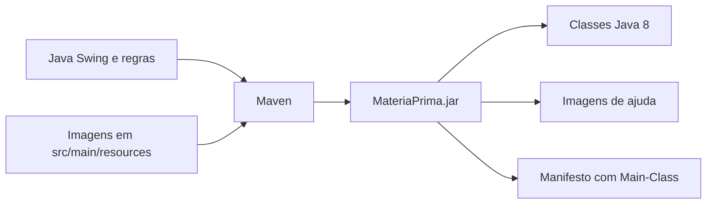

# UML do MateriaPrima

Os diagramas abaixo representam a arquitetura atual da aplicação. Eles usam
[Mermaid](https://mermaid.js.org/) e podem ser visualizados diretamente em
renderizadores Markdown compatíveis, incluindo o GitHub.

## Diagrama de classes

## Sequência do cálculo

## Componentes de distribuição

