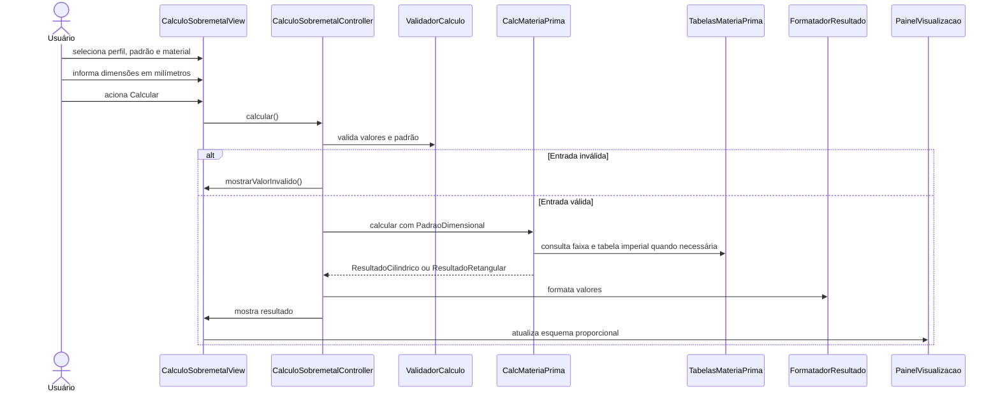
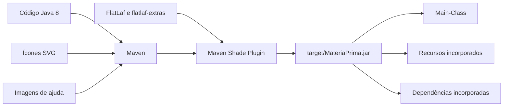

# UML do MateriaPrima

Os diagramas representam a estrutura atual da aplicação e usam
[Mermaid](https://mermaid.js.org/).

## Diagrama de classes

```mermaid
classDiagram
    direction LR

    class Main {
        +main(String[] args)$ void
    }

    class TemaAplicacao {
        +instalar()$ boolean
    }

    class CalculoSobremetalView {
        -controller CalculoSobremetalController
        -painelVisualizacao PainelVisualizacao
        +getValor1() String
        +getValor2() String
        +getValor3() String
        +isPerfilCilindrico() boolean
        +isOtimizar() boolean
        +getPadraoDimensional() PadraoDimensional
        +getMaterialSelecionado() Material
        +mostrarResultadoCilindrico(...) void
        +mostrarResultadoRetangular(...) void
        +mostrarVisualizacaoCilindrica(...) void
        +mostrarVisualizacaoRetangular(...) void
        +mostrarValorInvalido() void
    }

    class PainelVisualizacao {
        +mostrarCilindrico(...) void
        +mostrarRetangular(...) void
        +limpar(boolean) void
        #paintComponent(Graphics) void
    }

    class CardPanel
    class Icones {
        +carregar(String, int)$ Icon
    }

    class CalculoSobremetalController {
        -view CalculoSobremetalView
        -validador ValidadorCalculo
        -formatador FormatadorResultado
        +calcular() void
    }

    class ValidadorCalculo {
        +lerValor(String) Double
        +valoresCilindricosValidos(Double, Double, Double, PadraoDimensional) boolean
        +valoresRetangularesValidos(Double, Double, Double, boolean, PadraoDimensional) boolean
        +limiteDiametroCilindrico() double
    }

    class FormatadorResultado {
        +polegadas(String) String
        +diametroMilimetros(double) String
        +milimetros(double) String
        +quilogramas(double) String
    }

    class CalcMateriaPrima {
        -material Material
        +calcularCilindrico(double, double, boolean) ResultadoCilindrico
        +calcularCilindrico(double, double, boolean, PadraoDimensional) ResultadoCilindrico
        +calcularRetangular(double, double, double, boolean) ResultadoRetangular
        +calcularRetangular(double, double, double, boolean, PadraoDimensional) ResultadoRetangular
        -calcularSobremetal(double) double
        -selecionarDimensaoMetrica(double) DimensaoComercial
        -selecionarDimensaoPolegada(double, boolean) DimensaoComercial
    }

    class PadraoDimensional {
        <<enumeration>>
        METRICO
        POLEGADA
    }

    class DimensaoComercial {
        -milimetros double
        -descricao String
        -padrao PadraoDimensional
        +getMilimetros() double
        +getDescricao() String
        +getPadrao() PadraoDimensional
    }

    class Material {
        -nome String
        -densidade double
    }

    class FaixaSobremetal {
        -limiteMinimo double
        -limiteMaximo double
        -sobremetal double
        +contem(double) boolean
    }

    class ResultadoCilindrico {
        -diametroMilimetros double
        -descricaoDiametro String
        -comprimentoTotal double
        -sobremetal double
        -massa double
    }

    class ResultadoRetangular {
        -larguraMilimetros double
        -alturaMilimetros double
        -comprimentoMilimetros double
        -larguraDescricao String
        -alturaDescricao String
        -comprimentoDescricao String
        -massa double
    }

    class TabelasMateriaPrima {
        -MATERIAIS$ Material[]
        -FAIXAS_SOBREMETAL$ FaixaSobremetal[]
        -DIMENSOES_POLEGADA$ DimensaoComercial[]
        +materiais()$ Material[]
        +faixasSobremetal()$ FaixaSobremetal[]
        +dimensoesPolegada()$ DimensaoComercial[]
    }

    Main --> TemaAplicacao : instala tema
    Main --> CalculoSobremetalView : cria
    CalculoSobremetalView --> CalculoSobremetalController
    CalculoSobremetalView --> PainelVisualizacao
    CalculoSobremetalView --> CardPanel
    CalculoSobremetalView --> Icones
    CalculoSobremetalController --> ValidadorCalculo
    CalculoSobremetalController --> FormatadorResultado
    CalculoSobremetalController --> CalcMateriaPrima
    CalculoSobremetalController --> PadraoDimensional
    ValidadorCalculo --> TabelasMateriaPrima
    CalcMateriaPrima --> TabelasMateriaPrima
    CalcMateriaPrima --> Material
    CalcMateriaPrima --> DimensaoComercial
    CalcMateriaPrima ..> ResultadoCilindrico : cria
    CalcMateriaPrima ..> ResultadoRetangular : cria
    DimensaoComercial --> PadraoDimensional
    TabelasMateriaPrima o-- Material
    TabelasMateriaPrima o-- FaixaSobremetal
    TabelasMateriaPrima o-- DimensaoComercial
```

## Sequência do cálculo

## Componentes de distribuição

